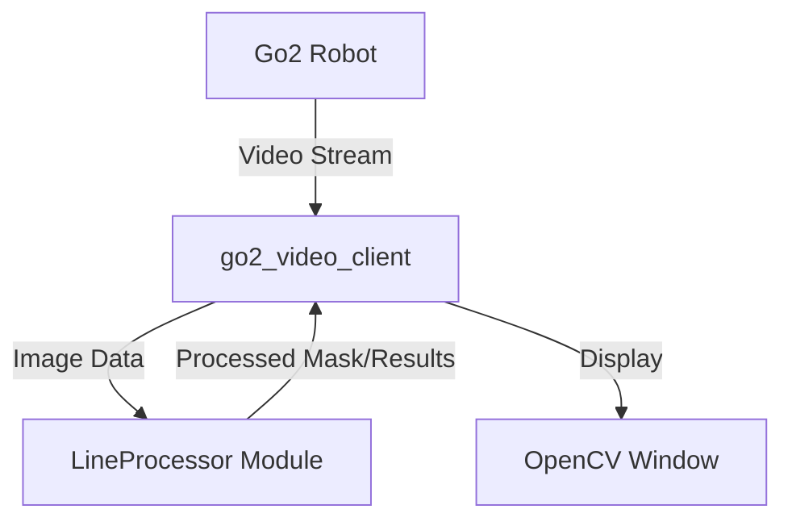

# Go2 Video Client

基于 Unitree SDK2 的 Go2 机器人实时视频客户端，用于实现视频流的获取与实时图像处理。

## 项目架构

本仓库采用模块化设计，旨在解耦视频流获取与具体图像算法。



- **核心客户端 (src/go2_video_client.cpp)**: 负责初始化 Unitree SDK2 的 `VideoClient`，建立与机器人的通信，实现视频流的实时获取与显示，并提供图片抓拍功能（按 `s` 键保存）。
- **图像处理模块 (LineProcessor)**: 位于 `include/` 和 `src/` 目录下，作为独立库编译，封装了各类图像滤波、二值化及形态学处理逻辑。
- **依赖管理**: 通过 `CMakeLists.txt` 集成 Unitree SDK2 及其底层 DDS 通信库，并依赖 OpenCV 进行图像矩阵运算。

## 依赖

- Unitree SDK2
- OpenCV 4.x

## 环境准备

本仓库需要 Unitree SDK2。为了方便编译，请在仓库根目录下创建到 SDK 的软链接：

```bash
ln -s /path/to/your/unitree_sdk2 ./unitree_sdk2
```

## 编译

```bash
mkdir build && cd build
cmake .. -DCMAKE_BUILD_TYPE=Release
make
```


确保机器人和 PC 在同一网络下：

```bash
# 默认使用默认网卡
./go2_video_client

# 也可以指定网卡（如 eth0, wlan0 等）
./go2_video_client eth0
```

按 `q` 或 `Esc` 退出，按 `s` 键抓拍并保存当前画面。

## 模块文档

详细的模块使用说明及接口定义请参阅：

- [LineProcessor 模块使用说明](docs/LineProcessor.md)
